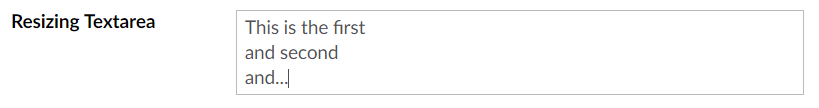
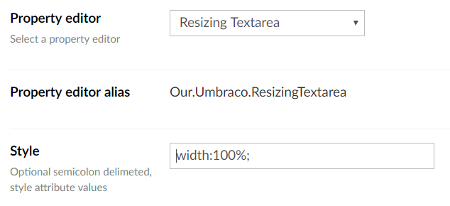

# Umbraco Resizing Textarea
Property editor for a textarea that resizes to fit the amount of text.

## Property Editor

    

## Property Editor Configuration

## Model

A built-in property-value-converter will return a string.